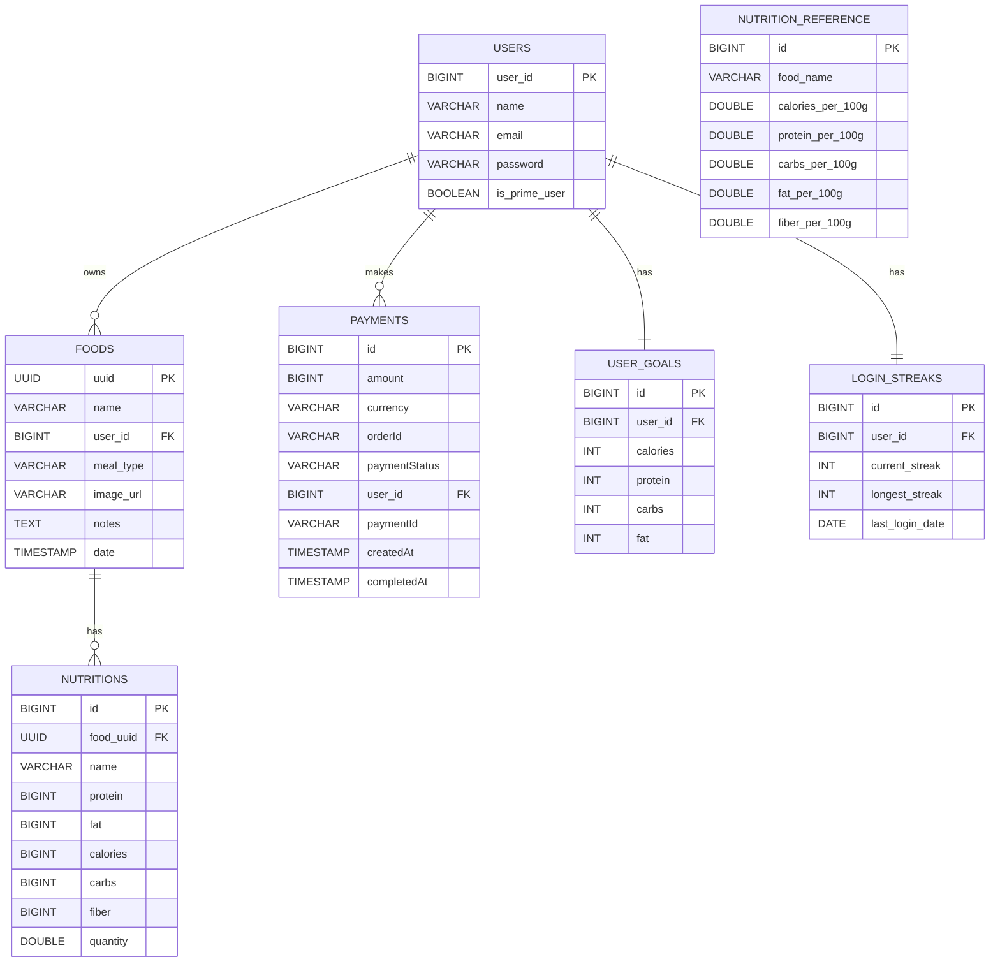

# CalorieTracker Backend — ER Diagram

This document describes the main entities and relationships for the CalorieTracker backend. Use the Mermaid diagram (below) or the separate Mermaid file `ER_DIAGRAM.mmd` in the repository for visualization.

## Entities (summary)

- User (`users`)
  - `user_id` (PK)
  - `name`
  - `email` (unique)
  - `password`
  - `is_prime_user`

- Food (`foods`)
  - `uuid` (PK)
  - `name`
  - `user_id` (FK -> users.user_id)
  - `meal_type` (enum)
  - `image_url`
  - `notes`
  - `date` (timestamp)

- Nutrition (`nutritions`)
  - `id` (PK)
  - `food_uuid` (FK -> foods.uuid)
  - `name`
  - `protein`, `fat`, `calories`, `carbs`, `fiber` (numeric)
  - `quantity` (double, grams)

- NutritionReference (`nutrition_reference`)
  - `id` (PK)
  - `food_name` (unique)
  - `calories_per_100g`, `protein_per_100g`, `carbs_per_100g`, `fat_per_100g`, `fiber_per_100g`
  - `created_at`, `updated_at`

- Payment (`payment`)
  - `id` (PK)
  - `amount`, `currency`, `orderId`, `paymentId` (unique)
  - `paymentStatus` (enum)
  - `user_id` (FK -> users.user_id)
  - `createdAt`, `completedAt`

- UserGoal (`user_goals`)
  - `id` (PK)
  - `user_id` (FK -> users.user_id) (unique)
  - `calories`, `protein`, `carbs`, `fat`

- LoginStreak (`login_streaks`)
  - `id` (PK)
  - `user_id` (FK -> users.user_id) (unique)
  - `current_streak`, `longest_streak`, `last_login_date`, `created_at`, `updated_at`

## Relationships

- `User (1) -- (N) Food` : a user owns many food entries
- `Food (1) -- (N) Nutrition` : a food has many nutrition items
- `User (1) -- (0..1) UserGoal` : optional daily goals per user (one-to-one)
- `User (1) -- (N) Payment` : payments made by a user
- `User (1) -- (0..1) LoginStreak` : one streak record per user
- `NutritionReference` is a standalone reference table used to compute nutrition values

---

## Mermaid ER diagram

Copy the following block into a Mermaid-capable viewer or see `ER_DIAGRAM.mmd` for the chart file.

